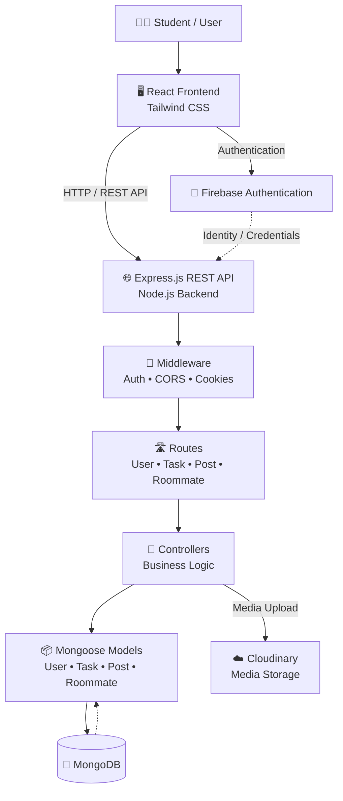
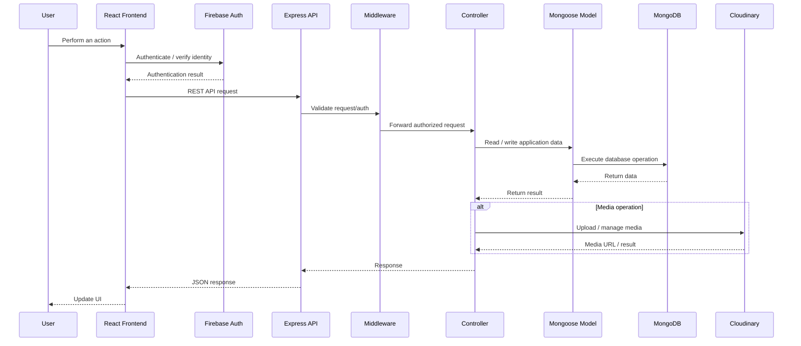
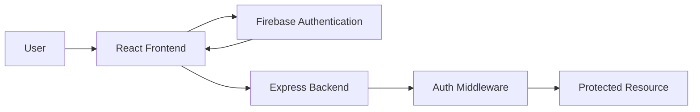
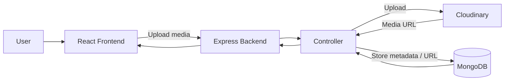

# NeerPeer

> A student-centric social networking platform designed to help college students discover peers, build meaningful connections, share experiences, and find compatible roommates within their college community.

NeerPeer combines **peer discovery, personalized student profiles, social posts, post interactions, and roommate matching** in a single full-stack web application.

---

## 📌 Overview

College communities often have students with similar interests, career aspirations, hobbies, and lifestyle preferences, but there is no dedicated platform to discover those connections.

**NeerPeer** addresses this problem by providing a centralized platform where students can:

- Create and manage their profiles
- Discover peers with similar interests and goals
- Share posts and interact with the community
- Find potential roommates based on preferences
- Upload profile/post media
- Authenticate securely using Firebase
- Communicate with a RESTful Node.js backend

The application follows a **separated frontend/backend architecture**, making the system easier to develop, maintain, and extend.

---

## ✨ Key Features

### 🔐 Authentication & Authorization
- Firebase Authentication for user authentication
- Backend-side Firebase Admin integration
- Protected application workflows
- Cookie and authentication middleware support

### 👤 Student Profiles
Users can maintain profiles containing information relevant to peer discovery, including:

- Academic information
- Interests
- Hobbies
- Career goals
- Lifestyle preferences

### 🤝 Peer Discovery
NeerPeer is designed around finding students with common:

- Interests
- Career aspirations
- Hobbies
- Lifestyle preferences

This creates a student-focused social network rather than a generic social-media feed.

### 📰 Social Feed
Users can:

- Create posts
- View posts
- Interact with posts
- Discover content shared by other students

### ❤️ Post Interactions
The post module provides the foundation for social engagement and interaction between users.

### 🛏️ Roommate Finder
The roommate module allows students to identify potential roommates using relevant preference data such as:

- Career aspirations
- Sports interests
- Lifestyle preferences

### ☁️ Media Management
Cloudinary is integrated for storing and managing uploaded media.

### 🌐 REST API
The frontend communicates with the backend through RESTful API endpoints organized by feature.

---

# 🏗️ System Architecture

NeerPeer uses a **client-server architecture** with a React frontend, Node.js/Express backend, MongoDB database, and external authentication/media services.



### Architecture Flow

A typical request travels through the application as follows:

**User → React UI → REST API → Middleware → Route → Controller → Model → MongoDB**

For media operations:

**Controller → Cloudinary**

For authentication:

**React Frontend → Firebase Authentication → Backend verification**

This separation keeps presentation, API routing, business logic, and persistence responsibilities distinct.

---

# 🔄 Request Lifecycle



---

# 🧱 Backend Architecture

The backend follows a modular structure separating API endpoints, controllers, models, middleware, configuration, and utilities.

```text
backend/
│
├── config/                 # Application/service configuration
│
├── controllers/            # Business logic
│   ├── post.controller.js
│   ├── roomate.controller.js
│   ├── task.controller.js
│   └── user.controller.js
│
├── db/                     # Database connection
│
├── middleware/             # Request/authentication middleware
│
├── models/                 # MongoDB/Mongoose schemas
│   ├── post.models.js
│   ├── roomate.model.js
│   ├── task.model.js
│   └── user.models.js
│
├── routes/                 # REST API route definitions
│   ├── post.route.js
│   ├── roomate.route.js
│   ├── task.route.js
│   └── user.route.js
│
├── utils/                  # Shared helper functionality
│
├── index.js                # Express application entry point
├── package.json
└── package-lock.json
```

### Backend Responsibilities

| Layer | Responsibility |
|---|---|
| `routes/` | Defines API endpoints and connects requests to controllers |
| `controllers/` | Contains application/business logic |
| `models/` | Defines MongoDB document schemas using Mongoose |
| `middleware/` | Handles cross-cutting request processing and authorization |
| `db/` | Establishes database connectivity |
| `config/` | Stores service/configuration setup |
| `utils/` | Provides reusable helper functions |
| `index.js` | Initializes Express, middleware, routes, database, and server |

---

# 🛣️ API Organization

The Express server groups APIs by application domain:

```text
/api/v1/2024
│
├── /user       → User & profile operations
│
├── /task       → Task-related operations
│
├── /roomate    → Roommate-related operations
│
└── /post       → Social post operations
```

This domain-based routing approach makes it easier to add new modules without restructuring the entire API.

---

# 🎨 Frontend Architecture

The frontend is built with React and Tailwind CSS.

```text
frontend/
│
├── public/                 # Static assets
│
├── src/
│   ├── components/         # Reusable UI components
│   ├── context/            # Shared React application state
│   ├── firebaseConfig/     # Firebase client configuration
│   ├── pages/              # Application pages/screens
│   ├── App.js              # Main application component
│   ├── index.js            # React entry point
│   ├── index.css           # Global styles
│   └── ...
│
├── package.json
└── tailwind.config.js
```

### Frontend Responsibilities

- Render the user interface
- Manage application/page state
- Handle user interactions
- Authenticate users through Firebase
- Send requests to backend REST APIs
- Display backend data
- Provide responsive styling using Tailwind CSS

---

# 🗄️ Data Layer

MongoDB is used as the primary application database, accessed through Mongoose.

The repository currently separates data models around the application's main domains:

```text
MongoDB
│
├── Users
│   └── Profile / student information
│
├── Posts
│   └── Social content and interactions
│
├── Roommates
│   └── Roommate preference/matching data
│
└── Tasks
    └── Task-related application data
```

This domain-oriented model organization allows each feature to evolve independently.

---

# 🔐 Authentication Architecture

Authentication is handled using **Firebase Authentication**, while the backend includes **Firebase Admin** support for server-side authentication workflows.



### Why Firebase?

Firebase provides a managed authentication layer while keeping authentication concerns separate from application business logic.

The backend can then focus on authorization and application-specific operations.

---

# ☁️ Media Upload Architecture

Cloudinary is used for media storage.



The application therefore avoids storing uploaded media directly inside MongoDB and instead stores references to externally hosted media.

---

# 🧩 Core Modules

## 1. User Module

Responsible for:

- User registration/authentication workflows
- Student profile information
- Profile management
- User-related API operations

**Route:** `/api/v1/2024/user`

---

## 2. Post Module

Responsible for:

- Creating posts
- Retrieving posts
- Post interactions
- Social feed functionality
- Post-related media

**Route:** `/api/v1/2024/post`

---

## 3. Roommate Module

Responsible for:

- Roommate preference data
- Roommate discovery
- Matching-oriented functionality

**Route:** `/api/v1/2024/roomate`

---

## 4. Task Module

Responsible for task-related application operations.

**Route:** `/api/v1/2024/task`

---

# 🛠️ Technology Stack

| Layer | Technology |
|---|---|
| Frontend | React |
| Styling | Tailwind CSS |
| Backend | Node.js |
| API Framework | Express.js |
| Database | MongoDB |
| ODM | Mongoose |
| Authentication | Firebase Authentication |
| Server-side Firebase | Firebase Admin |
| Media Storage | Cloudinary |
| File Upload Handling | Multer |
| HTTP Middleware | CORS, Cookie Parser |
| Real-time Foundation | Socket.IO dependency |

---

# 📁 Complete Project Structure

```text
NeerPeer/
│
├── backend/
│   ├── config/
│   ├── controllers/
│   │   ├── post.controller.js
│   │   ├── roomate.controller.js
│   │   ├── task.controller.js
│   │   └── user.controller.js
│   │
│   ├── db/
│   ├── middleware/
│   ├── models/
│   │   ├── post.models.js
│   │   ├── roomate.model.js
│   │   ├── task.model.js
│   │   └── user.models.js
│   │
│   ├── routes/
│   │   ├── post.route.js
│   │   ├── roomate.route.js
│   │   ├── task.route.js
│   │   └── user.route.js
│   │
│   ├── utils/
│   ├── index.js
│   ├── package.json
│   └── package-lock.json
│
├── frontend/
│   ├── public/
│   ├── src/
│   │   ├── components/
│   │   ├── context/
│   │   ├── firebaseConfig/
│   │   ├── pages/
│   │   ├── App.js
│   │   ├── index.js
│   │   └── index.css
│   │
│   ├── package.json
│   └── tailwind.config.js
│
└── README.md
```

---

# 🚀 Getting Started

## Prerequisites

Make sure the following are installed:

- Node.js
- npm
- MongoDB database
- Firebase project
- Cloudinary account

---

## 1. Clone the Repository

```bash
git clone https://github.com/nipunmodi/NeerPeer.git
cd NeerPeer
```

---

## 2. Configure the Backend

```bash
cd backend
npm install
```

Create a `.env` file:

```env
MONGOURL=<your_mongodb_connection_string>
PORT=<your_backend_port>
BACKEND_URL=<your_backend_url>

CLOUDINARY_CLOUD_NAME=<your_cloudinary_cloud_name>
CLOUDINARY_API_KEY=<your_cloudinary_api_key>
CLOUDINARY_API_SECRET=<your_cloudinary_api_secret>
```

Configure Firebase Admin credentials according to the project's Firebase configuration.

The current backend expects the Firebase credentials file to be available through the `config` directory and referenced by the Firebase configuration.

### Start Backend

Development:

```bash
npm run dev
```

Production-style start:

```bash
npm start
```

---

## 3. Configure the Frontend

```bash
cd ../frontend
npm install
```

Create a `.env` file:

```env
REACT_APP_BACKENDURL=<your_backend_url>

REACT_APP_API_KEY=<firebase_api_key>
REACT_APP_AUTH_DOMAIN=<firebase_auth_domain>
REACT_APP_PROJECT_ID=<firebase_project_id>
REACT_APP_STORAGE_BUCKET=<firebase_storage_bucket>
REACT_APP_MESSAGING_SENDER_ID=<firebase_messaging_sender_id>
REACT_APP_APP_ID=<firebase_app_id>
```

### Start Frontend

```bash
npm start
```

The React development server will start locally.

---

# 🔄 Local Development Flow

Run the two application layers independently:

```text
┌──────────────────────┐
│   React Frontend     │
│   localhost:3000     │
└──────────┬───────────┘
           │
           │ REST API
           ▼
┌──────────────────────┐
│   Express Backend    │
│   configured PORT    │
└──────────┬───────────┘
           │
           ▼
┌──────────────────────┐
│      MongoDB         │
└──────────────────────┘
```

External services:

```text
React ───────────────► Firebase Authentication

Backend ─────────────► Cloudinary

Backend ─────────────► MongoDB
```

---

# 🔒 Environment & Security

Never commit secrets or service credentials to Git.

The following should remain private:

- MongoDB connection strings
- Cloudinary API secrets
- Firebase service-account credentials
- Production API keys where applicable
- Any private deployment credentials

Use `.env` files locally and configure environment variables through your deployment platform in production.

---

# 📈 Scalability & Extensibility

The current architecture provides clear extension points for future functionality.

### Adding a New Feature

A typical new backend feature can follow:

```text
New Feature
    │
    ├── Model
    │
    ├── Controller
    │
    ├── Route
    │
    └── Frontend Page / Components
```

For example, a future **Notifications** module could be introduced as:

```text
models/notification.model.js
controllers/notification.controller.js
routes/notification.route.js
pages/Notifications/
components/Notification/
```

This keeps feature boundaries clear and reduces coupling.

---

# 🔮 Future Enhancements

Planned or potential improvements include:

- 💬 Real-time chat
- 🔔 Push/in-app notifications
- 🤝 Friend requests
- 🔎 Advanced search and filtering
- 🧠 AI-assisted roommate matching
- 🎯 Personalized peer recommendations
- 📱 Improved mobile responsiveness
- 🔐 More granular authorization
- 🧪 Expanded automated testing
- 🚀 Production deployment and CI/CD

---

# 🧪 Development Notes

The backend uses:

```bash
npm run dev
```

for development with Nodemon, while:

```bash
npm start
```

starts the Node.js server directly.

The backend dependencies include Express, Mongoose, Firebase Admin, Cloudinary, Multer, Socket.IO, CORS, Cookie Parser, and dotenv.

---

# 🎯 Project Goals

NeerPeer is designed with three primary goals:

1. **Connect students** with peers who share similar interests and ambitions.
2. **Simplify student life** through useful community-oriented features such as roommate discovery.
3. **Provide a scalable full-stack foundation** that can evolve into a broader student community platform.

---

# 🤝 Contributing

Contributions and improvements are welcome.

A typical contribution workflow:

```bash
git checkout -b feature/your-feature
```

Make your changes, test them locally, then commit:

```bash
git add .
git commit -m "Add: your feature"
git push origin feature/your-feature
```

Open a pull request with:

- A clear description of the change
- Screenshots for UI changes
- Testing details
- Any required environment/configuration changes

---

# 📄 License

This project is intended for educational and learning purposes.

---

## 👨‍💻 Author

**Nipun Modi**

Built as a full-stack student community platform using modern web technologies.
